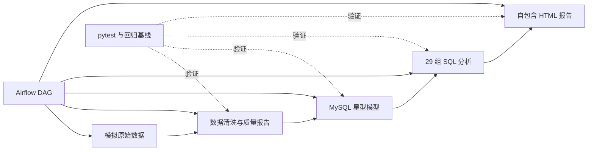

# 工业能耗分析（Industrial Energy Analysis）

[](https://github.com/YZC0219/industrial_energy_analysis/actions/workflows/build-pages-report.yml)

**在线演示：** [打开工业能耗可视化报告](https://yzc0219.github.io/industrial_energy_analysis/)

这是我的毕业设计项目。我围绕工业企业的能源管理场景，独立搭建了一条从模拟数据、数据清洗、MySQL 数据仓库、业务分析、异常检测，到 Airflow 调度和可视化报告的完整数据管道。

我没有把它做成只展示几张图的分析作业，而是把重点放在数据质量、统计口径、可重复运行和回归验证上。项目覆盖 8 个车间、6 种能源、2024-01-01 至 2025-12-31 共 731 天的数据，最终形成 29 组分析结果和一份可离线打开的 HTML 报告。

## 我完成的内容

- 我用固定随机种子生成带业务规律的模拟工业数据，并主动注入日期混乱、别名、缺失值、重复记录、负数、离群值和费用错误等 10 类质量问题。
- 我实现了可追溯的数据清洗流程，把剔除记录、修正记录和清洗统计分别落盘。
- 我在 MySQL 中设计了星型模型，包括 3 张维表、2 张事实表和 5 个口径/算法视图。
- 我编写了 Q01～Q29 分析查询，覆盖能耗结构、费用、单耗、同比环比、待机损耗、碳排放和异常检测。
- 我实现了 2σ、产量基线和 CUSUM 三种异常检测方法，并对它们的检出结果进行了对比。
- 我用原生 HTML、CSS、JavaScript 和 SVG 生成自包含报告，支持日期、车间和日型筛选，不依赖外部图表库。
- 我用 Airflow 和 Docker Compose 编排整条管道，并验证失败重跑、幂等装载和历史数据修正。
- 我建立了离线测试、数据库测试、29 份查询快照和端到端测试，防止口径或数据在改动后静默漂移。
- 我通过 GitHub Actions 自动生成并发布 Pages 报告；桌面端和移动端使用同一份数据与页面。
- 我把报告正文中的关键数字改为从分析结果自动插值，避免代码更新后文字仍停留在旧结论。

## 项目架构



Airflow 中的执行链为：

```text
generate_raw_data → clean_data → load_warehouse → run_analysis → build_report
```

（上面是 `dags/energy_pipeline_dag.py` 里的 `task_id`；对应的脚本依次是
`generate_data.py`、`clean_data.py`、`import_mysql.py --incremental`、
`import_mysql.py --run-analysis`、`make_report.py`。）

## 技术栈

| 领域 | 技术 |
|---|---|
| 数据处理 | Python、pandas、NumPy |
| 数据仓库 | MySQL 8.0、星型模型、窗口函数 |
| 数据装载 | PyMySQL、`LOAD DATA LOCAL INFILE`、幂等 upsert、水位线增量抽取 |
| 调度与运行 | Apache Airflow、Docker Compose |
| 分析方法 | 同比/环比、2σ、最小二乘基线、CUSUM |
| 可视化 | HTML、CSS、JavaScript、SVG |
| 质量保障 | pytest、快照测试、端到端测试 |

## 目录结构

```text
industrial_energy_analysis/
├─ dags/
│  └─ energy_pipeline_dag.py       # Airflow 五任务 DAG
├─ .github/workflows/
│  └─ build-pages-report.yml       # 自动生成并发布 GitHub Pages 报告
├─ data/                            # 本地生成的原始数据
├─ docker/
│  └─ airflow/Dockerfile
├─ docs/
│  ├─ index.html                    # GitHub Pages 在线报告
│  ├─ 交接说明_第二阶段任务A.md      # 增量装载的环境、遗留与验收
│  ├─ 指标字典.md
│  ├─ 数据清洗质量说明.md
│  ├─ 系统设计文档.md
│  ├─ 测试文档.md
│  └─ 问题发现与工程复盘.md
├─ output/                          # 本地生成的清洗、分析和报告产物
├─ sql/
│  ├─ create_table.sql              # 建库、维表、事实表和视图
│  └─ analysis.sql                  # Q01～Q29 分析查询
├─ src/
│  ├─ generate_data.py              # 生成模拟数据
│  ├─ clean_data.py                 # 清洗和质量留痕
│  ├─ import_mysql.py               # 建表、装载和执行分析
│  ├─ make_report.py                # 生成可视化报告
│  ├─ mobile.css                    # 移动端响应式样式
│  └─ report_template.html          # 报告模板
├─ tests/
│  ├─ baseline/                     # 29 份查询回归基线
│  └─ test_*.py                     # 离线、数据库和端到端测试
├─ tools/
│  ├─ calibrate_cusum_h.py          # CUSUM 判定限仿真校准
│  ├─ check_filter_ui.py            # 浏览器筛选与移动端验收
│  ├─ decompose_mom.py              # 月度环比的月长效应拆解
│  ├─ verify_dag_run.py             # Airflow DAG 验收
│  └─ verify_filter.mjs             # 前端聚合恒等式验证
├─ docker-compose.yml
├─ pytest.ini
└─ requirements.txt
```

`data/raw_energy_data.csv` 和 `output/` 下的文件都是可复现产物，因此我没有把它们继续纳入版本控制。运行下面的流程即可重新生成。

## 快速开始

### 方式一：在本机运行

环境要求：Python 3.9+、MySQL 8.0+。

```bash
pip install -r requirements.txt

# 1. 生成带脏数据的原始 CSV
python src/generate_data.py

# 2. 清洗并生成质量报告
python src/clean_data.py

# 3. 首次部署：建表 + 全量装载 + 执行全部分析
python src/import_mysql.py --init --full --run-analysis --user root --password 你的密码

# 4. 生成自包含 HTML 报告
python src/make_report.py
```

我也支持通过环境变量传入 MySQL 密码，避免密码进入命令行历史：

```powershell
# Windows PowerShell
$env:MYSQL_PWD="你的密码"
python src/import_mysql.py --init --full --run-analysis
```

```bash
# Linux / macOS
MYSQL_PWD=你的密码 python src/import_mysql.py --init --full --run-analysis
```

只重新执行分析时，可以运行：

```bash
python src/import_mysql.py --run-analysis
```

**首次部署用 `--init --full`，之后每天走增量**（不加参数就是增量）：

```bash
# 只装载水位线之后的新数据，并推进水位线
python src/import_mysql.py
```

`--init` 会按 `sql/create_table.sql` 重建事实表，而水位线表**故意不随之重置**
（它是进度状态，不是 schema）。所以 `--init` 不能单独使用 —— 那会让水位线领先于
被清空的数据，之后的数据被永久跳过。脚本会在运行期直接拒绝这种组合：

```
[错误] --init 会清空事实表, 但不会重置水位线 —— 单独使用会让水位线领先于数据,
       之后的数据会被永久跳过。
       首次部署请用: --init --full
```

最终报告位于 `output/report.html`，它已经内联全部数据和样式，可以直接在浏览器中打开。

### 方式二：使用 Docker Compose 和 Airflow

```bash
docker compose up -d --build
```

启动后打开 `http://localhost:8080`，使用 `admin / admin` 登录，在 DAG 列表中启用并触发 `energy_pipeline`。

编排环境包含 5 个服务：

| 服务 | 作用 |
|---|---|
| `mysql` | 保存维表、事实表和分析视图 |
| `airflow-init` | 初始化 Airflow 数据库和管理员账号 |
| `airflow-webserver` | 提供 Airflow Web 界面 |
| `airflow-scheduler` | 调度 DAG 任务 |
| `airflow-triggerer` | 支持可延迟任务 |

## 数据模型

我采用星型模型组织数据：

| 类型 | 表 | 说明 |
|---|---|---|
| 维表 | `dim_workshop` | 车间、工序、生产方式和产量单位 |
| 维表 | `dim_energy_type` | 能源品种、折标煤系数、碳排放因子和参考单价 |
| 维表 | `dim_calendar` | 日期、工作日、周末和法定节假日 |
| 事实表 | `fact_energy_consumption` | 车间 × 日期 × 能源品种的消耗明细 |
| 事实表 | `fact_production` | 车间 × 日期的产量 |

我把重复使用的统计口径和算法中间量封装在 5 个视图中：

- `v_energy_enriched`：统一计算折标煤、碳排放和费用。
- `v_daily_workshop`：汇总车间日度综合能耗。
- `v_monthly_workshop`：汇总车间月度能耗和单位产品能耗。
- `v_unit_energy_baseline`：计算产量基线、残差和白化残差。
- `v_unit_energy_cusum`：计算上下侧 CUSUM 和判定限。

完整指标定义、单位和适用口径见 [`docs/指标字典.md`](docs/指标字典.md)；
整体的设计取舍与分层见 [`docs/系统设计文档.md`](docs/系统设计文档.md)。

## 我统一的统计口径

工业能源分析最容易出现的问题不是 SQL 报错，而是不同页面使用了不同口径。我在项目中明确区分了三类口径：

1. **全厂口径**：用于能源结构、总量和总费用分析。
2. **剔除公用工程口径**：用于单位产品能耗，避免动力站生产蒸汽与其他车间消费蒸汽造成重复计算。
3. **仅连续型车间口径**：用于气温相关性分析，减少停产日对相关系数的干扰。

折标煤系数采用 GB/T 2589-2020 的当量值。电力碳排放因子采用 0.5703 kgCO₂/kWh；压缩空气作为二次能源，不重复计算碳排放。

## 数据清洗设计

我在原始数据中注入了 10 类问题，并为每种问题定义了明确处理方式：

| 问题 | 我的处理方式 | 留痕 |
|---|---|---|
| 多种日期格式 | 逐种格式解析，无法解析才剔除 | `clean_rejects.csv` |
| 车间名和能源名别名 | 映射为标准编码和名称 | 修正记录 |
| 能源编码缺失 | 根据标准能源名称回填 | 修正记录 |
| 单位写法不一致 | 统一为主数据中的标准单位 | 修正记录 |
| 业务键重复 | 按日期 × 车间 × 能源去重 | `clean_rejects.csv` |
| 消耗量离群 | 按车间 × 能源的 `Q3 + 3×IQR` 识别，置空后插补 | 拒绝与修正记录 |
| 负消耗量 | 取绝对值 | `clean_fixed.csv` |
| 消耗量缺失 | 按车间 × 能源 × 年月的中位数插补 | `clean_fixed.csv` |
| 单价缺失或为 0 | 按能源 × 年月的中位数插补 | `clean_fixed.csv` |
| 费用偏差超过 5% | 按消耗量 × 单价重算 | `clean_fixed.csv` |

我曾在这里发现并修复一个会制造假异常的缺陷：旧逻辑把离群值所在的整行删除，导致某些“车间-日期”永久少一种能源，日总能耗因此突然下降，后续 CUSUM 把它识别成持续异常。我把处理改成“只把离群单元格置空，再交给插补”，清洗后的 5,848 个车间日不再缺少能源品种。

修复效果如下：

| 指标 | 修复前 | 修复后 |
|---|---:|---:|
| 清洗后能耗明细 | 18,972 | 19,006 |
| 消耗量插补 | 295 | 329 |
| 品种数不足的车间日 | 34 | 0 |
| 单耗残差 Z 值下限 | -11.6 | -3.27 |

更完整的核对过程见 [`docs/数据清洗质量说明.md`](docs/数据清洗质量说明.md) 和 [`docs/问题发现与工程复盘.md`](docs/问题发现与工程复盘.md)。

## 分析内容

29 组查询大致分为以下几类：

| 查询 | 内容 |
|---|---|
| Q01～Q04 | 能源总量、车间排名、能源结构和费用结构 |
| Q05～Q08 | 月度趋势、环比、同比和单位产品能耗 |
| Q09～Q15 | 费用帕累托、车间结构、气温、停产日和节假日分析 |
| Q16～Q23 | 单耗异常、连续上涨、移动平均、价格、碳排和突增预警 |
| Q24 | 车间单耗完整序列及 μ ± 2σ 控制带 |
| Q25 | 考虑产量和季节因素的期望单耗与残差 |
| Q26 | 2σ、产量基线和 CUSUM 三种检测方法对比 |
| Q27 | 白化残差的上下侧 CUSUM 序列 |
| Q28～Q29 | 动态筛选所需的车间日度汇总和能源结构明细 |

## 异常检测方法

### 2σ 固定阈值

我用每个车间自己的历史均值和标准差识别单日大偏离。这个方法直观，但容易把节假日低产量造成的高单耗当成异常。

### 产量基线

我使用产量和年内季节项拟合期望单耗：

```text
期望单耗 = a + b·ln(产量) + g·sin(2π·年内日序/365) + h·cos(2π·年内日序/365)
```

模型在 SQL 中通过最小二乘正规方程闭式求解。相比固定阈值，它先解释产量和季节变化，再判断残差是否异常。

### CUSUM

我先按“车间 × 日历月”对白化残差去季节性，再计算上下侧 CUSUM。判定限没有直接照搬常见的 `5σ`，而是根据当前序列长度进行 5,000 次白噪声仿真，最终采用零分布 99 分位对应的 `h = 9.9σ`。

这个选择来自实际验证：对每个车间约 730 个观测点的序列，`5σ` 会产生过高的累计误报率，无法作为可靠阈值。

## 可视化报告

我没有引入第三方图表库，而是用 SVG 绘制图表，并把查询数据内联到一个 HTML 文件中。报告包括：

- 总览、结构、趋势、成因、成效、损耗和风险分析；
- 2σ 控制图、产量基线残差图和 CUSUM 图；
- 日期、车间和日型动态筛选；
- 深色/浅色主题；
- 悬停提示和等价表格视图；
- 经过 OKLab ΔE 与对比度检查的配色；
- 手机、平板和桌面端响应式布局；
- GitHub Actions 自动重建并发布到 GitHub Pages。

### 数据大屏视图

筛选栏右侧可以切到「数据大屏」——同一份内联数据的第二种呈现：一屏放下 6 个 KPI（综合能耗、能源费用、碳排放、单位产品能耗、末期环比、待机损耗）和 7 张图（月度能耗、月度环比、能源结构堆叠、车间对比、车间×日热力图、近 30 天日线含 7 日移动平均、车间 Pareto），供投屏和看板场景使用。

这里没有新增查询、没有新增数据管道，大屏直接复用报告已有的 `Q28`/`Q29` 前端立方体和筛选器引擎，因此两份视图在任意筛选下的数字是同一个来源、逐位一致。切换视图只改 `html` 上的 `dash-mode` 类，不重新请求数据。

三处刻意的取舍：

- **单耗 KPI 只在恰好选中一个车间时给数。** 各车间产量单位不同（吨 / 件 / 台 / 平方米，见 `docs/指标字典.md` §1），跨车间把产量相加没有物理意义——8 个车间混在一起除出来是 4.78 kgce/t，而熔炼车间单独是 68.6 kgce/t，前者不对应任何真实量。其余情况显示破折号并说明原因，而不是给一个会被读成"全厂单耗"的假数。
- **单耗 KPI 与热力图都排除公用工程（W07）。** 动力站产出的蒸汽供其他车间二次消费，计入单耗会重复计算，与 Q03/Q18 的口径一致。
- **月度能耗与月度环比是两张图，不是双轴。** 折标煤（tce）和环比（%）量纲不同，叠进一个坐标系会读出一个由坐标缩放造出来、数据里并不存在的相关性。环比单独成图，零点画在图中——正负是两个方向相反的结论。

生成报告：

```bash
python src/make_report.py
```

`src/report_template.html` 只是模板，本地成品是 `output/report.html`。推送报告模板、生成脚本、移动端样式、查询基线或管道上游（`generate_data.py`、`clean_data.py`、`import_mysql.py`、`sql/`）后，GitHub Actions 会重建报告并更新 `docs/index.html`。

CI 里报告是**用 `tests/baseline/` 的查询结果当数据源**生成的，不连数据库——这样构建快且可复现。代价是有一个静默风险：如果我改了口径却忘了刷新基线，报告会照着旧基线生成，数字自洽、CI 全绿，只是结论已经过期。所以发布**之前**先起 MySQL 跑一遍完整管道和 29 条查询，与基线逐行比对，不一致就中止发布，并提示运行 `tests/update_baseline.py`。

校验必须排在"把基线拷进 `output/`"之前——那个比对读的正是 `output/` 下的 CSV，先拷贝会让两者相等、比对恒等通过，守卫就成了摆设。

在线版本：<https://yzc0219.github.io/industrial_energy_analysis/>

### 报告中的两项口径说明

- Q22 的“月度能耗环比超过 25%”与 Q24 的“日单耗 2σ 异常”不是同一指标。当前 5 条月度告警在对应月份内均没有 2σ 超限日，因此我没有制造一个大多为空的“告警跳转异常日”功能，而是在两个区域分别解释各自口径。
- Q05/Q22 使用合法的“月度总量环比”口径，但相邻月份有 28～31 天，结果包含月长效应。报告保留原始口径，同时展示按日均能耗拆解后的结果；复核脚本为 `tools/decompose_mom.py`。

## 自动化测试

```bash
# 默认只运行离线测试，不要求 MySQL
pytest

# 数据库测试
MYSQL_PORT=3307 pytest -m db

# 重跑整条管道的端到端测试
MYSQL_PORT=3307 pytest -m "db and slow"

# 经 Airflow 触发 DAG 并检查五个任务状态
python tools/verify_dag_run.py

# 验证前端筛选后的立方体、KPI 和日汇总恒等
node tools/verify_filter.mjs

# 使用 Playwright 验证筛选交互、控制台错误和横向溢出
python tools/check_filter_ui.py
```

`check_filter_ui.py` 默认优先用本机 `C:\Program Files\Google\Chrome\Application\chrome.exe`，找不到才回落到 Playwright 自带的 headless shell——CI 上装的是后者，本机可能只有前者。

| 测试文件 | 我验证的内容 | 是否需要 MySQL |
|---|---|---|
| `test_clean_data.py` | 清洗规则、业务键、缺失值、产物一致性 | 否 |
| `test_metric_dictionary.py` | 指标字典与代码中的系数、参数和口径一致 | 否 |
| `test_import_mysql.py` | 幂等装载、中断续跑、历史修正、旧版本保护、水位线推进与不倒退 | 是 |
| `test_analysis_snapshot.py` | Q01～Q29 与基线逐行比对 | 是 |
| `test_end_to_end.py` | 产物完整性、时效性和多条链路结果自洽 | 是 |

我把 29 份查询结果保存在 `tests/baseline/`。当业务口径发生有意变更时，我先检查差异，再更新基线：

```bash
python tests/update_baseline.py --check
python tests/update_baseline.py
```

如果我无法解释数字为什么变化，就不会用刷新基线掩盖问题，而是先检查数据库数据是否陈旧、装载是否完整以及统计口径是否被意外修改。

每一层测试分别防什么、为什么这么分层、哪些地方**故意没有**加断言，见 [`docs/测试文档.md`](docs/测试文档.md)。

## 幂等装载、历史修正与增量水位线

能源事实表以 `(record_date, workshop_code, energy_code)` 作为业务唯一键。我先把 CSV 装入临时表，再执行 `INSERT ... SELECT ... ON DUPLICATE KEY UPDATE`。

更新时，我通过 `updated_at` 判断版本：只有严格更新的记录才能覆盖现有数据，旧批次重放不会把后来修正过的值改回去。`LOAD DATA LOCAL INFILE` 不可用时，批量 `INSERT` 分支复用同一套 upsert 逻辑。

这个设计解决了 `INSERT IGNORE` 会静默丢弃历史修正的问题，也保证了任务失败后可以安全重跑。

### 增量装载与水位线

每晚全量重建 19,006 行事实表在演示环境够用，但这不是数据仓库该有的装载方式。所以我加了 `etl_watermark` 表记录装载进度，之后每次只装箱内新增的行。

**三个设计决定值得说明：**

**水位线列用 `updated_at`，不用 `record_date`。** 对"每天追加一天"的新数据两者等价。但上游**修正**一条历史记录时，`record_date` 不变而 `updated_at` 变晚 —— 用 `record_date` 做水位线，修正记录会永远落在水位线左侧，永远进不了增量批次。那等于把刚做好的历史修正能力，在增量路径上又关掉了。用 `updated_at` 则"水位线判新旧"与"upsert 判新旧"共用同一列，语义自洽。

代价是无法发现**删除**（上游删了一行，水位线右侧没有它，增量装载感知不到），且依赖源系统时间戳单调递增。这两条都写进了[系统设计文档](docs/系统设计文档.md)的已知局限。

**`etl_watermark` 不进 `create_table.sql` 的 `DROP` 清单。** 判定标准是"重置它会不会丢已完成的工作"：`dim_workshop` 的种子行是主数据，该随之重置；水位线的行是进度，不该重置。所以它用 `CREATE TABLE IF NOT EXISTS`，独立于重建。

这条决定有一个**强制性配套**，不是可选项：`--init` 因此必须退出每晚路径。如果保留 `--init` 而水位线不在 `DROP` 清单里，每晚事实表被清空、水位线却活了下来 —— 下一批取空集，**数据永久丢失且管道报 success**。所以 `load_warehouse` 改成 `--incremental`，`--init` 只在首次部署手工跑一次，且 `--init` 不带 `--full` 的组合会被运行期直接拒绝。

**装载与水位线推进必须在同一个事务里。** 这是整个方案的核心正确性属性。若分成两个事务提交，"装载写了一半就崩溃"会让水位线**领先于数据**：下次从崩溃点之后取数，那半批记录永久丢失，且管道每次报 success —— 这类缺陷极难排查。放进同一事务后，所有不一致都退化成"数据领先于水位线"这种可自愈形态：下一批重放同一区间，upsert 幂等，不产生重复。

为了让这条约束在代码里看得见，`advance_watermark()` **只接收 `cursor` 不接收 `conn`** —— 它没有 commit 的能力，用签名表达"你不得自己提交"。

实现上还有几个细节：水位线用 `GREATEST` 推进（重放旧批次不会让它倒退），空批次（`MAX` 返回 `NULL`）**不推进**水位线只记 `last_rows=0`，以及 `MAX` 从**已入库数据**取而不是从 CSV 取 —— 水位线描述"表里有什么"，而不是"我尝试过什么"。

### 清洗是无状态的，过滤是装载端的事

每晚的 `clean_data` 用 `--batch-all`：**不设窗口**，按批次文件名写出全量范围的数据。理由是清洗不该知道数据库里的水位线停在哪——否则换一个数据源就得改清洗脚本。按 `updated_at > 水位线` 过滤是装载端的事，它本来就要做这个判断。

代价是模拟环境里批次文件装了一整天、其中绝大多数行被恰好滤掉。这是刻意的：把"上游的边界"和"数仓的进度"解耦，比省这点 IO 重要。

### 一个只有真跑才发现的问题

注入一天新数据后做增量装载，事实表**正确**变成 19,054 行、水位线**正确**推进，但 Q01 的综合能耗**纹丝不动**。

原因是 `v_energy_enriched` 用 `INNER JOIN dim_calendar`，而全部 29 条查询都经这个视图。日期维表的范围写死在 `clean_data.build_calendar()` 里（2024-01-01 ~ 2025-12-31），所以新日期的行**装得进事实表，却在视图的 JOIN 里被整批滤掉**——事实表行数正常、水位线正常、管道报 success，而所有分析结果里这批数据一行都看不见。

这是最坏的一类失败：无声，且伪装成成功。所以我给增量装载加了一道守卫，越界直接终止：

```
[错误] 批次数据有 2026-01-01, 但 dim_calendar 只到 2025-12-31。
       这些行能装进事实表, 但会在 v_energy_enriched 的 JOIN 里被
       静默滤掉 —— 分析结果看不见它们, 而管道不会报错。
```

真实场景的修法是让日期维表随日期滚动生成。但无论维表怎么维护，装载端都该**校验而不是假设**——维表范围是上游给的，上游会变。

> 这个问题的发现方式值得记一笔：它不是读代码看出来的，是靠"注入一天数据、然后逐项断言 Q01 该涨多少"跑出来的。前两轮验证（重复装 0 行、历史修正）都碰不到它，因为那些日期都在维表范围内。

### 清洗按完整数据计算，窗口只影响落盘

一个容易踩的坑：我**没有**给 `clean_data.py` 加"只读窗口内数据"的参数。

清洗有全局统计依赖 —— 离群判决用 `车间×能源` 全体的 Q1/Q3，缺失值插补用 `车间×能源×年月` 的中位数。如果切窗口清洗，插补值会和全量跑不同，于是"增量跑一天"与"重跑全量"给出**两份不同的事实表**，而且只在跨月/跨年批次边界暴露，极难查证。

正确做法是内部仍全量计算（口径和逐字节可复现性都不变），只把窗口内的行写成 `clean_batch_energy.csv` / `clean_batch_production.csv`。有一条测试专门守这个：批次行必须是全量行的逐字节子集。

## 当前结果

固定随机种子为 `20240918`。当前数据得到的部分结果如下：

| 指标 | 结果 |
|---|---:|
| 2024～2025 全厂综合能耗 | 63,759.63 tce |
| 全厂能源费用 | 约 2.15 亿元 |
| 全厂碳排放 | 156,783.46 tCO₂ |
| 天然气与气温相关系数 | -0.9555 |
| 蒸汽与气温相关系数 | -0.9262 |
| 表面处理车间停产日待机损耗 | 58 天 / 110.89 tce |

这些数值由脚本生成，并由查询快照和文档一致性测试共同保护。

## 当前进度

### 已完成

- 从模拟数据生成、清洗留痕、MySQL 星型模型到 29 组 SQL 分析的完整链路；
- 2σ、产量基线和 CUSUM 三种异常检测方法及对比分析；
- 基于 `updated_at` 的水位线增量装载、幂等 upsert、历史修正和失败重跑保护；
- 日期、车间、日型动态筛选，以及桌面端/移动端响应式可视化；
- GitHub Pages 在线演示和 GitHub Actions 自动构建；
- 指标字典、系统设计、测试说明、清洗质量说明和工程复盘；
- 离线测试、数据库测试、端到端测试、29 份查询快照与前端验收脚本。

### 正在完善

- Windows 本机与 Docker 两种运行方式的故障排查说明；
- 毕业论文中的系统实现、实验结果与异常检测对比章节；
- 答辩演示脚本、关键页面讲解顺序和可复现实验步骤。

### 计划功能

- 让日期维表按数据范围滚动扩展，替代当前 2024～2025 固定范围；
- 为增量链路补充删除捕获机制，解决水位线只能发现新增和更新、不能发现源端删除的限制；
- 在真实企业数据可用后，重新校准异常阈值并验证模拟数据结论的外推性。

产品维度和班组维度暂不进入必做范围；当前模型先保持“车间 × 日期 × 能源”的核心粒度。我会继续通过独立提交记录每项能力的演进，保证每次修改都能说明动机、实现和验证结果。
