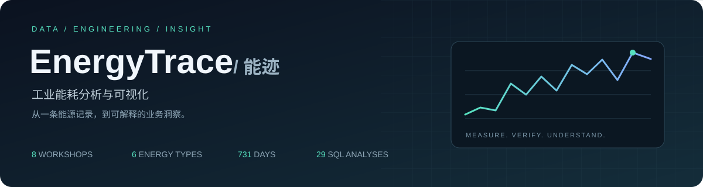
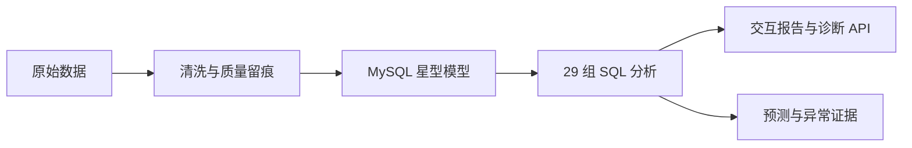

<p align="center"></p>

<p align="center">
<a href="https://github.com/YZC0219/industrial_energy_analysis/actions/workflows/build-pages-report.yml"></a>


</p>

<p align="center"><a href="https://yzc0219.github.io/industrial_energy_analysis/"><strong>查看在线报告 ↗</strong></a>　·　<a href="#快速开始">快速开始</a>　·　<a href="docs/项目完整说明.md">完整说明</a>　·　<a href="docs/问题发现与工程复盘.md">工程复盘</a></p>

## 从能源记录到业务洞察

我是大数据专业的学生，在 AI 辅助下持续开发这个项目，练习从原始数据到分析报告的完整过程。我负责确定分析问题、检查结果、提出修改要求，并逐步理解实现。

能迹模拟一家制造企业两年的用能情况：**8 个车间 · 6 种能源 · 731 天 · 29 组 SQL 分析**。用 Python 清洗数据、MySQL 建模和分析，再把结果做成可以筛选的网页报告。

> 基础链路使用带业务规律的模拟数据。真实数据案例、单节点实验与模拟节能情景各有验证边界，详见[交付与剩余事项](docs/项目交付与剩余事项.md)。

## 数据如何流动


```mermaid
flowchart LR
    A[原始数据] --> B[清洗与质量留痕]
    B --> C[MySQL 星型模型]
    C --> D[29 组 SQL 分析]
    D --> E[交互报告与诊断 API]
    D --> F[预测与异常证据]
```

| 数据工程 | 分析与建模 | 交付与验证 |
|---|---|---|
| 可追溯清洗、幂等装载、历史修正 | 能耗结构、单耗、费用、碳排放 | 桌面 / 手机报告、FastAPI、Metabase |
| MySQL 星型模型、Airflow 调度 | 2σ、产量基线、CUSUM、滚动预测 | 查询快照、回归测试、前端聚合核验 |
| Hive / Spark / DataX 可选旁路 | 季节基线、树模型与深度模型对照 | 语义目录、诊断反馈、持久化告警 |

## 能看到什么

固定随机种子 `20240918` 下，基础模拟数据得到以下结果：

| 2024～2025 综合能耗 | 全厂能源费用 | 全厂碳排放 |
|:---:|:---:|:---:|
| **63,759.63 tce** | **约 2.15 亿元** | **156,783.46 tCO₂** |

- **待机损耗：**4 个间歇生产车间、58 个停产日，合计约 79.39 万元。
- **基线节能量：**以 2024 年单耗为基线，估算 2025 年节能量 731 tce。
- **节能毛收益：**约 247 万元，未扣除改造投入，不代表投资回报或真实工厂实测收益。

计算口径见[指标字典](docs/指标字典.md)，交互结果见[在线分析报告](https://yzc0219.github.io/industrial_energy_analysis/)。

## 两次让我学到东西的排查

**清洗造成了假异常。** 删除离群值整行后，34 个“车间 × 日期”缺少能源品种，CUSUM 因此报警。改为异常单元格置空、按车间 × 能源 × 月份插补后，缺少品种的车间日从 **34 降到 0**，并加入回归测试。

**装载成功，报告没有变化。** 新记录进入事实表后，日期维表未覆盖新日期，分析视图的 `INNER JOIN` 把它们过滤了。清洗现在按数据范围扩展日期维表，装载也检查日期边界。

→ [阅读完整工程复盘](docs/问题发现与工程复盘.md)

## 快速开始

环境：**Python 3.12、MySQL 8.0+**。在项目根目录运行；Windows 缓存和测试产物使用 D 盘。

```powershell
python -m pip install -r requirements.txt -r requirements-extensions.txt --cache-dir D:/industrial_energy_analysis/.pip-cache
python src/generate_data.py
python src/clean_data.py
python src/import_mysql.py --init --full --run-analysis --user root --password 你的密码
python src/make_report.py
```

打开 `output/report.html` 查看报告。`--init --full` 用于首次建库；后续增量装载运行 `python src/import_mysql.py`。连接配置见[完整说明](docs/项目完整说明.md)。

<details>
<summary><strong>诊断工作台 · 异常证据与处置反馈</strong></summary>

已有分析输出时：

```powershell
python -m uvicorn src.api:app --host 127.0.0.1 --port 8010
```

访问 <http://127.0.0.1:8010/diagnostics>。支持异常筛选、证据问答、人工处置和追加历史。模型配置需设置进程环境变量；未配置时使用证据检索模式。本地入口尚无身份认证，人工反馈不自动成为已验证训练标签。

GitHub Pages 展示静态报告；问答与反馈需要运行 API。详见[工作台说明](docs/智能诊断工作台.md)。

</details>

<details>
<summary><strong>Docker / Airflow · 调度与结果检查</strong></summary>

```powershell
docker compose up -d --build
```

访问 <http://localhost:8080>，在 Airflow 中触发 `energy_pipeline`。Docker 数据位置按本机环境配置；详见[Windows 运行手册](docs/Windows_Docker_故障排查与答辩演示.md)。

```powershell
python -m pytest -q --basetemp D:/industrial_energy_analysis/tmp/pytest
# MySQL 已启动时，显式运行数据库测试
$env:MYSQL_PORT = "3307"
python -m pytest -m db -q --basetemp D:/industrial_energy_analysis/tmp/pytest_db
# 已生成报告时核验前端聚合
node tools/verify_filter.mjs
```

默认测试排除 MySQL `db` 测试。项目保留 29 组 SQL 快照，统计口径变化需先查清差异再更新基线。详见[测试文档](docs/测试文档.md)。

</details>

## 正在扩展的能力

| 模块 | 入口与说明 |
|---|---|
| 统一指标与 BI 消费 | `governance/` · [报告 / API 消费迁移](docs/语义层消费迁移_报告与API.md) · [Metabase 迁移](docs/Metabase语义层迁移.md) |
| 持久化告警与恢复 | `streaming/` · Kafka 桥接、Redis 恢复、HTTP 确认、重试与人工重入队 · [复验记录](docs/告警与整体验收复验_20261004.md) |
| 快照审计与设备排程 | `lakehouse/`、`optimization/` · [四方向扩展](docs/工业数据生命周期_四方向扩展.md) |
| 前端分析公式 | `src/analysis_formulas.js` · [接入原报告](docs/分析公式接入原报告入口.md) |
| 学习与独立复现 | `docs/daily_lessons/` · [两个月学习计划](docs/两个月项目学习计划.md) |

<details>
<summary><strong>实验条件与完成边界</strong></summary>

- Hive / Spark / DataX 在 Ubuntu 单节点完成结果对照和迟到修正；10× / 100× 仅验证隔离环境的部分核心指标。
- 预测模型在模拟数据上做滚动时序对照；缺少真实故障标签，不报告提前预警天数。
- Kafka / Flink 是单机窗口与故障注入实验；隔离链路已验证物理删除 CDC 与 Hive 投影。
- 主业务 CDC 已启用每日 02:00（Asia/Shanghai）更新，自动批次恢复验收通过，仍依赖 Windows、Docker 与 VM/HDFS 在线。
- 多节点高可用、真实工厂节能实测与生产部署尚未完成。

精选验收证据随版本保存；密钥、缓存、临时副本和生成数据库保留在本地。

</details>

## 文档导航

| 了解设计 | 查看实验 | 学习与复现 |
|---|---|---|
| [系统设计](docs/系统设计文档.md) | [阶段一 · 分层数仓](docs/阶段一_分层数仓与分布式计算.md) | [完整运行说明](docs/项目完整说明.md) |
| [指标字典](docs/指标字典.md) | [阶段二 · 预测与归因](docs/阶段二_预测与智能归因.md) | [学习计划](docs/两个月项目学习计划.md) |
| [工程复盘](docs/问题发现与工程复盘.md) | [阶段三 · 实时管道](docs/阶段三_数据质量与实时管道.md) | [阶段四 · 服务化交付](docs/阶段四_服务化与可视化交付.md) |
| [交付边界](docs/项目交付与剩余事项.md) | [阶段五 · 能效情景](docs/阶段五_能效基线与节能情景.md) | [真实数据展示页](docs/phase5.html) |

<p align="center"><sub>EnergyTrace · 从数据出发，让每一个结论有据可查。</sub></p>
