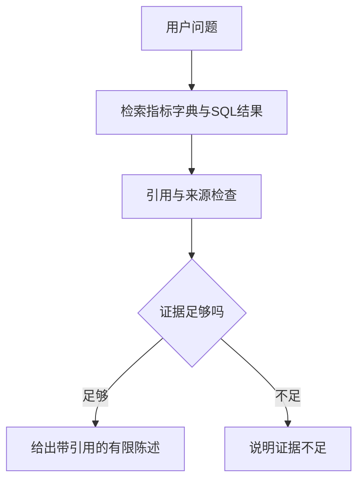

# 归因证据与离线复现

在from_zero练习目录运行python -m ml.evaluate_attribution。实际结果：4项离线检查通过、0次在线模型调用；online_refuse_missing_maintenance_record跳过。output/attribution_eval.json记录每项来源、引用数及结果。

卡片：预测回答可能多少；归因需要解释依据；确认设备故障还需要维护记录或现场证据。

例子：SQL发现W04停产时产生费用，可以报告费用及记录范围，不能自动推断是空压机泄漏。后者需要设备级计量和维护证据。

离线模式是检索与守卫的受控替身，会使用排序靠前证据，不是完整自然语言问答产品。4/4是已执行用例通过，不是5/5，也不证明在线模型质量。在线调用可能产生费用、需要明确配置和独立评测，本轮没有读取模型密钥或发起外部模型调用。

练习：没有维修记录，但异常检测报告连续高耗能，能否写“已确认设备故障”？参考：不能，只能报告异常线索和建议核查，不能补造原因。
