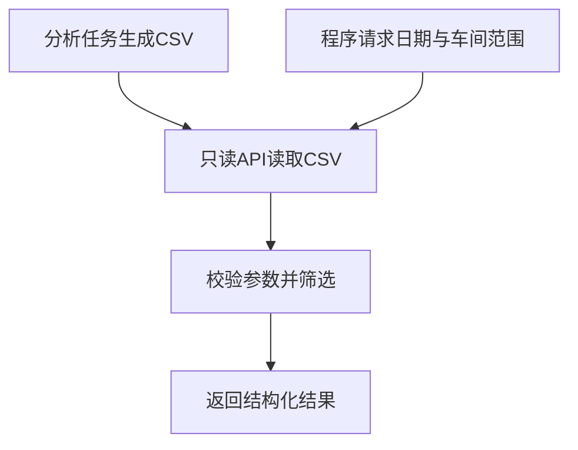

# 接口复现说明

当前隔离副本复制src/api.py及governance/catalog.py、metrics.yaml、__init__.py，使用ENERGY_OUTPUT_DIR明确指向练习输出。接口只读CSV，不连接MySQL/Hive。22项现有接口测试已通过；另用实际查询产物进行ASGI进程内请求核对，见api_verification.json。未启动网络服务，不能由此宣称端口访问、认证、HTTPS或部署完成。

卡片：接口像服务窗口，程序提出请求，返回明确字段；读取快照的接口仍不等于实时数据库查询。

实际例子：请求/api/v1/metrics并指定2025-01-01到2025-01-31、W01，返回31个不同日期、费用2410864.55元，和报告交叉核对案例一致。全期返回215364002.57元。起始日期晚于结束日期返回422；语义目录含29组查询。/health的ok仅表明指定文件存在，不证明所有CSV字段和数字有效、最新或服务所有能力完好。

重复验证：在本练习目录执行python verify_api.py；规则测试执行python -m pytest tests/test_api.py -q，并将TEMP/TMP、缓存和临时测试目录设在D盘。学习启动网络服务前需确定未占用端口和本地访问范围。

练习：record_days与workshop_days有什么不同？参考：前者是不同日期数量；后者是日期×车间记录数量。31天、8个车间每天都有记录时，分别31和248。不能用248作为全厂日均费用的天数分母。

错误语义：422表示请求参数不符合要求；503可能表示产物缺失或字段无效；404可表示未知指标。不要把这些都归为服务器程序崩溃，先检查请求、文件和对应规则。

本机HTTP更新：verify_api_network.py实际启动127.0.0.1临时端口，健康/筛选指标/OpenAPI/docs检查通过，结束后关闭服务。详情api_network_verification.json。认证、HTTPS与外网访问未验证。
