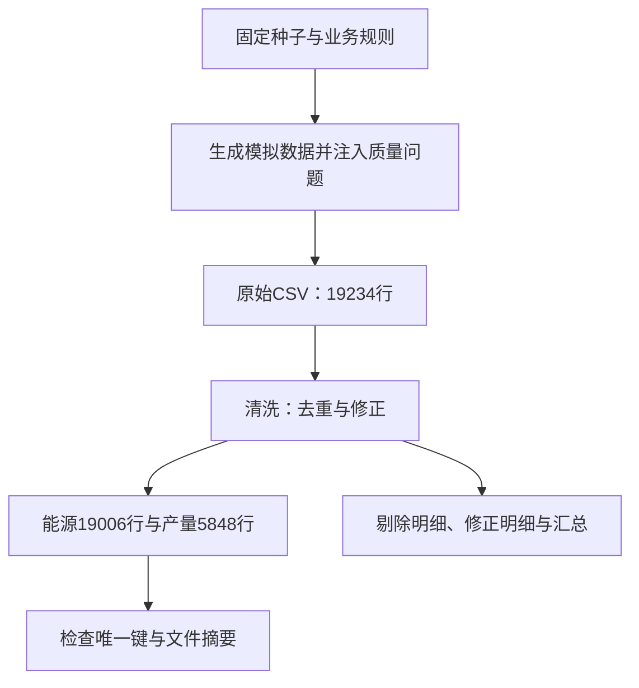

# 从零复现练习一：生成与清洗

本练习由当前项目两个源码文件复制构成，不是整个项目的独立副本。所有读写均在本目录；不访问数据库、不启动服务。已于2026-10-03实际运行并核对。Python 3.13.2、pandas 3.0.6，版本与源码摘要见verification.json。

## 操作
在PowerShell逐条执行：

```powershell
$env:PYTHONDONTWRITEBYTECODE = '1'
python D:\industrial_energy_analysis\docs\daily_lessons\practice\from_zero\src\generate_data.py
python D:\industrial_energy_analysis\docs\daily_lessons\practice\from_zero\src\clean_data.py
```

运行会重新写入本练习目录中的data与output。两个源码文件通过自身位置定位项目根，因此不能只把它们挪到其他文件夹然后仍假设输出位置不变。

## 预期结果
原始数据19234行；能源明细19006行；产量5848行；日期731天。删除228条业务键重复记录。另有329处消耗量插补（包含34处离群置空）、267处单价插补、243处费用重算。修正计数可能作用于同一行，不能相加当作不同记录数。

清洗生成clean_rejects.csv（剔除）、clean_fixed.csv（修正）、clean_report.txt（汇总），用来追踪变化。插补值是估计，不能因为已经清洗就视为真实计量。

## 已验证
- 原始文件与当前主线原始文件SHA256相同。
- 能源文件与上一次批次复现文件SHA256相同。
- 产量文件与当前主线产量文件SHA256相同。
- 能源日期×车间×能源键唯一；产量日期×车间键唯一。
以上是特定版本与输入的复现证据，不是所有规则正确或整个项目完成的证明。

## 图解


卡片：能运行只是开始；还要核对输入版本、处理依据、输出内容与业务约束。

例子：19234−228=19006解释能源明细行数变化；产量5848=731×8来自按日期与车间组织，不能用19234减几项修正统计得到。

## 练习及参考答案
1. 为什么固定种子有帮助？参考：让模拟随机过程在同一逻辑和适用环境下可重复；只固定种子仍不保证跨版本代码与依赖始终相同。
2. 为什么能源19006行，而不是731×8×6=35088行？参考：不是每个车间都使用六种能源，生成器给各车间配置自己的能源组合。
3. 为什么329+267+243不能直接当作修正记录数？参考：同一行可能同时修改消耗、单价和费用，属于不同处理动作计数。
4. 如报缺少pandas怎么办？参考：先确认正在使用的Python路径和依赖环境；新增环境与缓存放D盘，不能凭猜测安装或更换项目依赖。

下一步为清洗规则深入与独立数据库复现。默认离线测试不涵盖数据库；报告基线数据也不能替代重新执行SQL。用户还未提交练习反馈，不能标记已掌握。

## 报告生成（已实际运行）

复制当前项目src/make_report.py与src/report_template.html后，在练习目录运行：

```powershell
python D:\industrial_energy_analysis\docs\daily_lessons\practice\from_zero\src\make_report.py
```

输入为练习库实际执行的Q*.csv与本练习原始数据；输出为output/report.html。报告不直接查询MySQL，因此生成成功不能单独证明数据库状态正确，本次数据库证据在database_verification.json。内联JSON解析成功，费用215364002.57元，与本次库内总量一致；HTML无外部脚本src。尚未通过浏览器验证渲染、筛选、图表与控制台错误，不能标记前端验收完成。

卡片：数据库把记录算成结果，报告把结果变成图表；查看报告与重新查询数据库是不同操作。

练习：更改数据库后，直接打开旧report.html是否能看到新结果？参考：不能自动看到；需要执行对应分析、更新CSV，再重新生成报告。自包含表示数据随文件保存，不表示实时读取数据库。

## 浏览器核验更新
实际使用已有Chrome无界面打开练习报告：初始指标显示731天；选择只保留W01后指标变化；重置后恢复原指标；390像素宽手机视口没有页面横向溢出；页面产生12个SVG；本次未捕获JavaScript运行错误。截图与browser_verification.json已保存。覆盖范围仅初始加载、车间筛选、重置和手机视口，不覆盖全部日期/日型/大屏/图表交互，也未逐项核对每张图的数字。

发现报告正文仍写“24条查询”，而当前SQL实际生成29份查询结果。这是展示文字过时，不能用报告正文推断查询总数；本轮保留模板以忠实记录当前行为，未修改业务项目。筛选提示明确说明正文数字仍为全期口径，筛选后不能把正文固定数字与动态指标直接对比。

## 日期与日型交叉核验
2025年1月、W01熔炼车间：独立读取Q28查询CSV并求和得到31天、费用2410864.55元、能耗715.297908 tce；浏览器筛选聚合结果一致（浮点末尾误差在核验容差内）。再仅保留工作日：18天、费用1433921.59元、能耗425.104012 tce，同样一致。大屏可切换，重置恢复731天，未捕获页面异常。

为了读取闭包内的聚合值，验证器在browser_temp内生成报告临时副本，仅增加只读聚合值访问器；用户报告和原项目未修改。这是带观测入口的浏览器验证，不代表所有展示文本/图表逐项验收。初始加载、车间筛选和手机检查此前使用未修改报告进行。详情见filter_verification.json。

讲解卡片：筛选要同时作用于日期、车间和日型；统计天数按不同日期计算，不能把8个车间的每日行数当作8天。

具体例子：2025年1月共31个日期，8个车间每天各有一条汇总时有248条车间日记录，但仍是31天。若用248作为全厂日均分母，会把日均值压低8倍。

练习：为什么工作日费用1433921.59元不能与全月费用2410864.55元直接比较后认定工厂节能？参考：统计天数分别18天和31天，范围不同；还要比较产量与条件。不能把筛掉的日期当作实际消耗减少。
