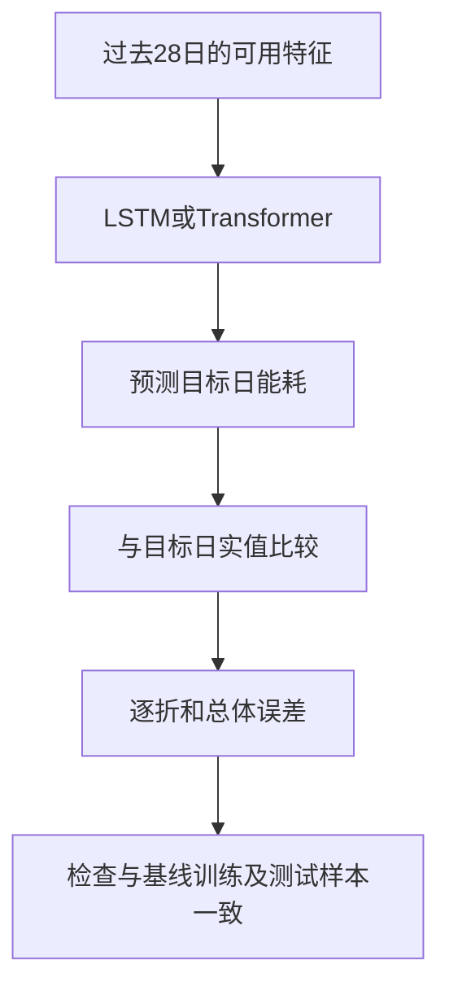

# 深度模型复现与验收

本轮在from_zero隔离目录启动默认12轮训练的LSTM及Transformer复现，未降低训练轮数。入口：
```powershell
python tools/run_phase2.py --energy output/clean_energy.csv --production output/clean_production.csv --deep-only
```
前置常规模型产物验证已输出ML_ARTIFACTS PASS。训练进程尚未确认完成，不写入最终指标，不标记验收通过。输出日志deep_run.log，结果路径output/ml_deep_predictions.csv、output/ml_deep_metrics.json；来源绑定记录output/ml_provenance.json。

## 日常解释
LSTM依次读取历史信息，学习序列中哪些变化需要记住；Transformer用注意力机制学习历史各位置与当前预测的关系。它们在本项目中都读取28日历史窗口，而不是拥有未来记录。模型更复杂不保证测试误差更小。



卡片：模型比较必须同题同卷。两种模型若预测日期、车间、训练记录不同，分数不能直接代表谁更好。

验收脚本检查：模型集合、测试键、每折训练/测试数量及训练键摘要、预测明细可重算MAE/RMSE、训练结束早于预测日、不完整尾折排除、无确认事件标签时提前量必须为空。这些检查不等于全部架构与无泄漏逻辑得到数学证明；仍需结合特征来源和标准化实现审查。

例子：预测100、实值110，误差10；预测120、实值110，误差同为10。绝对误差只衡量偏离大小；平均值不能告诉你全部高估/低估方向，也不能替代逐折检查。

练习：某模型总体MAE更低，但11折中有3折更高，能否说它每次预测都更好？参考答案：不能，总体平均优势不代表每折或每条记录优势。仍需查看逐折与明细，且不能外推到其他工厂。

## 完成结果
训练进程退出码0；DEEP_ARTIFACTS PASS models=2 predictions=5280。
|模型|样本|MAE tce|RMSE tce|
|---|---:|---:|---:|
| lstm | 2640 | 0.521300927459755 | 0.853823024179199 |
| transformer | 2640 | 0.544799574946614 | 0.841507672869592 |
本轮由默认12轮训练生成，来源绑定记录已更新；不代表用户已掌握。
