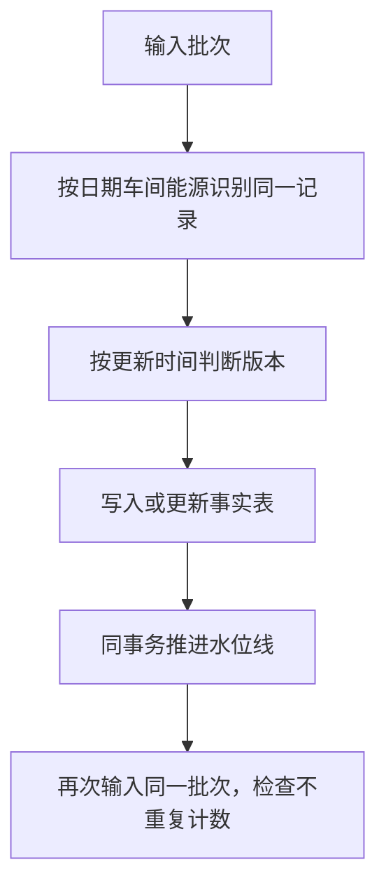

# 重复装载与增量进度练习

实际对独立练习库运行一次--full和两次默认增量装载，均使用同一批数据，无--init或--truncate。能源行数、费用、最大更新时间、产量行数和进度水位线保持一致。见repeat_import_verification.json与三份repeat日志。生产数量合计仅作重复前后内部一致性检查，因不同车间单位不同，不能视为全厂业务产量。

卡片：幂等表示相同操作重复执行，关键结果不被重复累计。水位线是处理进度，不是业务发生日期。

具体例子：一条记录第一次入库费用100元，重复导入同一版本仍是100元，不能变成200元。若历史日费用修正为110元，需要保留相同业务键并让更新时间反映新版本；本轮尚未执行修正实验，不能说已验证。

代码边界：当前import_mysql.py增量分支把批次内记录装入，再由版本规则与水位线处理；代码明确说装载侧不再次按水位线过滤。因此“增量=物理上只读取新行”不适用于所有当前调用。全量批次重复导入保持结果一致，不代表重复时没有扫描或执行写入动作。要讲清批次生成范围、版本比较、进度推进分别是谁负责。

练习：业务日期是2024-03-15，但修正时间是2026-10-03，应按哪个时间判断新版本？参考：更新时间；仅按业务日期判断会漏掉旧日期的新修正。真实系统还需确认更新时间可信、时区及同时间冲突处理。

本次未验证故障回滚、历史修正、软删除传播和完整调度。数据量保持不变也不能证明所有字段不变，后续需要逐字段/摘要验证。
