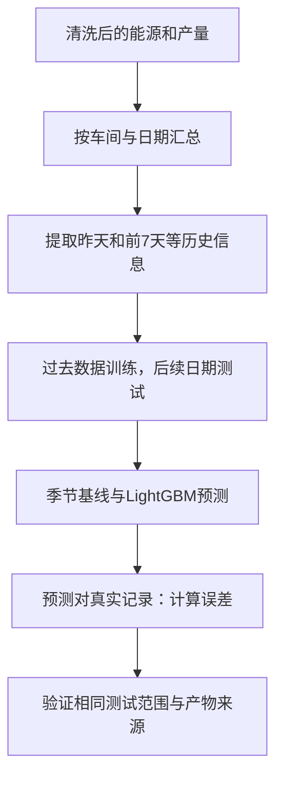

# 预测复现练习：先准备，学习按课程进度进行

本材料对应第16课。准备完成不代表用户已掌握，不据此跳过前面的数据与SQL课程。

## 已实际运行
在from_zero练习目录执行：
```powershell
python tools/run_phase2.py --energy output/clean_energy.csv --production output/clean_production.csv
```
当前环境LightGBM 4.7.0、scikit-learn 1.9.1。输出5848条特征、5280条预测（两个模型各2640条）、metrics和SHA256输入/产物绑定记录。runner最后输出ML_ARTIFACTS PASS，验证重算特征、预测指标及共同样本契约。

## 为什么要预测
分析过去回答“昨天发生了什么”；预测回答“在今天开始前已知信息下，今天可能用多少能源”。两者的数据可用时间不同。



卡片1：特征是模型可以看的信息，例如昨天的能耗；目标是想预测的今天能耗。特征表存有今天目标，不代表可以把目标列当输入。
卡片2：训练是用过去样本学习规律；测试是检查它对未参与拟合的后续目标表现怎样。
卡片3：未来信息泄漏像考试提前看到答案，会让分数好看而实际不可用。

## 时间例子
预测1月10日能耗时，1月10日的星期几提前知道，可以使用；1月10日全天实际产量、温度和费用还没发生完，不能直接使用。当前代码把实绩产量、温度、价格和事后状态比例统一滞后一天。历史均值先shift(1)再rolling，避免把当天目标混入均值。预测每个后续日期时会使用此前已经观测到的真实值，属于滚动单步预测，不是一次预测整个月。

## 实際切分
先预热28日，再以365日初始训练、完整30日测试、30日步长，共11折。训练窗口逐折扩展，不是每折始终只有365天。每模型2640条测试记录=11×30×8；末尾不足完整测试折的8天不计分。

MAE是绝对误差的平均值，单位tce。预测10、12、8，实值9、10、9，绝对误差1、2、1，MAE=4/3≈1.33 tce。误差越小表明该评估范围下数值预测更接近实值，不意味着原因解释正确。

## 练习
1. 当天最终产量是未来信息吗？参考：对当天开始前的预测来说，是；若有事先生产计划，必须有明确可用时间与独立计划字段，不能用事后实绩冒充。
2. MAE为0.5 tce能否说提前发现设备故障？参考：不能，MAE衡量预测误差，故障提前量需要经确认事件标签。
3. 为什么两个模型必须使用相同测试记录？参考：不同日期或车间可能难度不同，直接比较会把范围差异误当成模型差异。

## 边界
本轮只复现季节基线和LightGBM，未运行LSTM/Transformer、在线归因或故障提前量验证。主线仍为模拟数据；指标结果以本次output/ml_model_metrics.json为准，不能外推所有真实工厂。完整模型与归因复现仍待完成。
