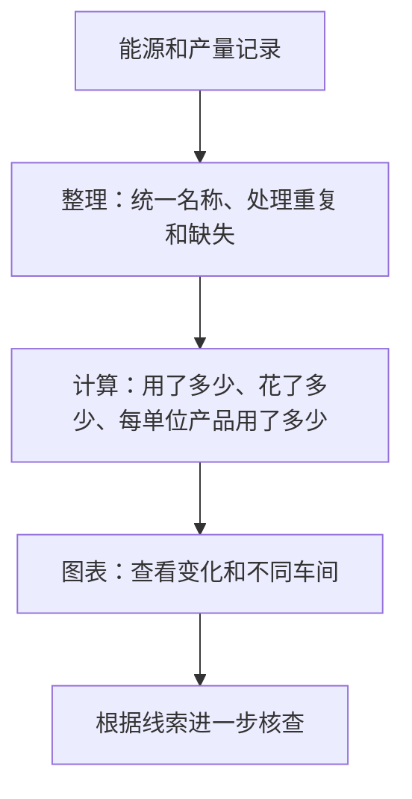

# 第一天：这个项目为什么值得做？（两个月课程版）

建议20～30分钟。今天只建立业务理解；无需运行代码。没有上一课需要回顾。此前高级实验是后续参考，不是今天的要求。

## 今天的目标
能用自己的话说出项目用途、解释总用电与每吨用电的区别、知道主线模拟数据不能证明真实工厂改造效果。

## 1. 工厂有账单，为什么还需要分析？
想象你负责一家工厂，电费账单显示本月比上月多花2万元。你首先需要知道：是生产更多，还是电价变了？哪个车间增长最多？停产后还有没有消耗？

账单提供总结果，能源和生产记录提供进一步分析的线索。本项目把分散记录整理成可比较的指标与图表。可以把它想成“能源账本＋体检报告”。体检提示值得检查的问题，确认原因仍需要现场和其他证据。

## 2. 三张讲解卡片
| 卡片 | 问题 | 解释 |
|---|---|---|
| 总量 | 一共用了多少？ | 看总体消耗规模；生产更多时总量可能增加 |
| 单耗 | 每单位产品用了多少？ | 能源数量÷产量；比较时还需产品、单位和生产条件可比 |
| 核查线索 | 哪里值得检查？ | 停产消耗、突增等是线索，不能直接认定设备故障 |

## 3. 项目的基本流程

项目主线实际上还包含入库步骤，方便组织和查询数据；今天只需理解“记录→整理→计算→展示”的业务关系。详细文件和技术实现将在后续课程逐步展开。

## 4. 具体例子：电多用了，是否一定变差？
以下是假设例子，产品、计量范围和生产条件假设可比，不是工厂实测。

| 时间 | 用电 | 产量 | 每吨用电 |
|---|---:|---:|---:|
| 昨天 | 1000度 | 100吨 | 1000÷100=10度/吨 |
| 今天 | 1200度 | 150吨 | 1200÷150=8度/吨 |

今天总用电增加了200度，但产量增加了50吨。每吨用电由10下降到8，因此不能只凭总量增加认定单位产品更耗能。真实判断还要检查产品与工况；也不能直接说某次改造导致下降。

本项目各车间的产量单位不同，有吨、件、平方米、台等。因此“每吨”仅是这个教学例子的单位，不是全项目所有车间的统一口径。今天记住“每单位产品”就足够。

## 5. 模拟数据到底是什么意思？
主线记录由程序生成，设置生产、季节、停产等规律，再主动加入缺失和重复等问题，用来练习数据工程与分析。主线覆盖8个车间、6种能源、731天；不要求背数字。

比如程序预先设置单耗逐年下降，后来分析发现下降，说明系统识别出了模拟规律，不等于真实工厂已经实施改造并取得节能。独立真实数据案例会在后续课程讲。

## 6. 今天只做一个小任务
用三句话回答：
1. 这个项目帮工厂回答什么问题？
2. 为什么用电增加不一定说明每单位产品更耗能？
3. 为什么模拟分析不能证明真实工厂已经节能？

参考答案：
1. 帮助了解哪里用能多、每单位产品消耗怎样、停产或突增记录是否值得核查。
2. 产量可能增长更快；需计算单耗并检查条件是否可比。
3. 模拟记录由程序生成，真实效果需要实际实施日期、前后计量及可比较条件。

两个理解检查：
- 停产仍耗电，能否全部定性为浪费？参考：不能，可能含安全、保温等必要负荷，需要核查。
- 分析异常，能否直接写“已确认设备故障”？参考：不能，异常是线索，需要现场或维护证据。

## 7. 今天怎样算学到位？
能讲出上述三句话即可；若还不理解，我们换例子复习。今天不以安装环境、运行服务或读懂全部代码为要求。明天主题是“一条记录是什么意思”，在你反馈后确认继续还是复习。

## 证据与状态
依据README.md、docs/系统设计文档.md及已核对的生成器车间配置。教学假设不作为实测，材料生成不代表掌握。本次未运行服务或高级实验，学习状态：第一天已讲解，掌握等待用户反馈。
