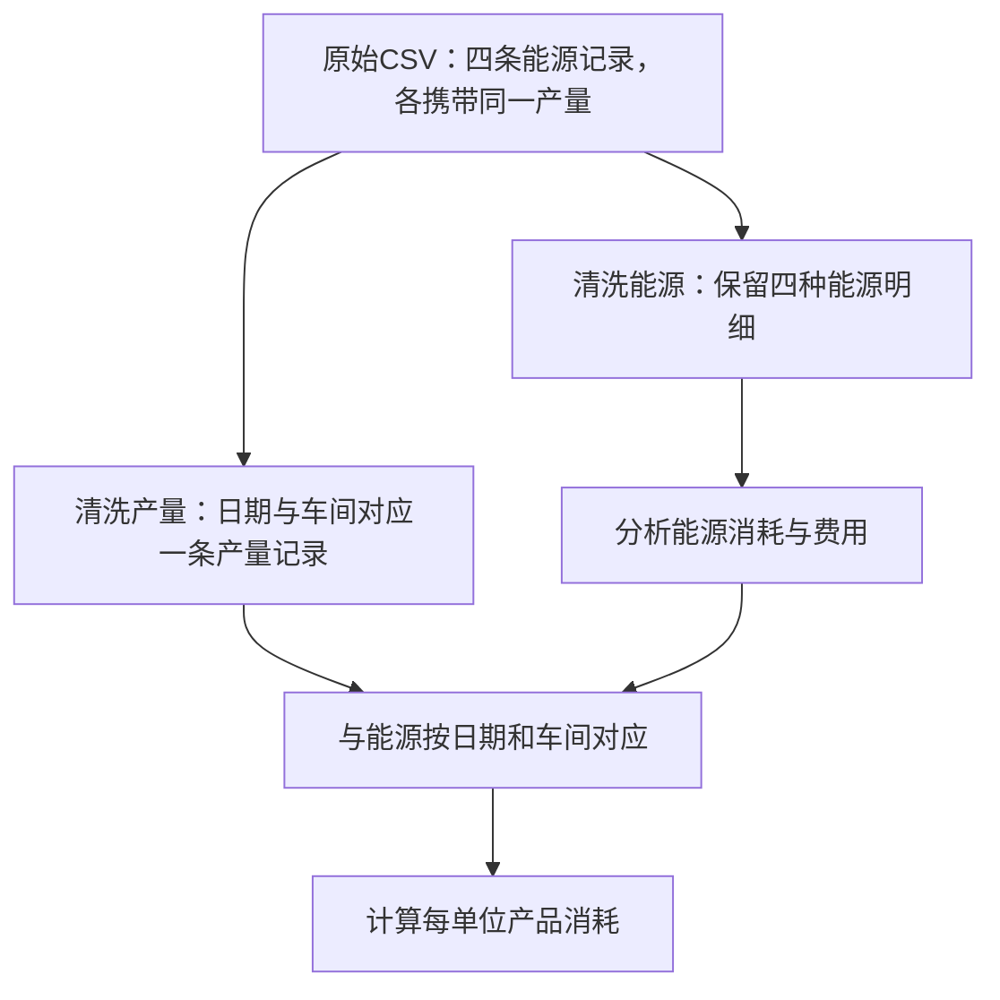

# 第 1 课：这个项目到底在做什么？

把它想成一家工厂的“能源账本 + 体检报告”。电表和生产系统提供记录，项目把这些记录整理成能帮助管理者决策的结果。

它主要回答：哪个车间用能最多？同样生产一吨产品，哪个车间更耗能？停产时还有多少待机消耗？某天能耗突然增加，值得检查哪些记录？

对应主线文件依次为 src/generate_data.py、src/clean_data.py、src/import_mysql.py、sql/analysis.sql、src/make_report.py。Airflow 的作用是按顺序安排这些步骤，像生产线的调度员。

### 为什么只看总能耗不够？

假设昨天用电 1,000 度、生产 100 吨；今天用电 1,200 度、生产 150 吨。总用电增加了 20%，但每吨用电从 10 度降到 8 度，下降了 20%。因此“总能耗增加”与“每吨产品更耗能”是两个问题。

这个例子只用于解释计算，不是项目实测结果；产品、工况等条件不同时，单耗比较还需要进一步核查。

### 今天的小任务

打开 README.md 开头，找出项目的数据范围和交付结果，然后补全一句话：“这个项目把____加工成____，帮助工厂判断____。”

### 理解检查

1. 用电变多，是否一定说明效率变差？参考答案：不一定，还要看产量与工况。
2. 图表能否证明某次改造确实节能？参考答案：不能仅凭图表证明，还需要同厂实施日期、改造前后计量与可比较条件。

### 本课证据与边界

根据 README.md 与系统设计文档，主线覆盖 8 个车间、6 种能源、731 天，使用具有业务规律并主动注入质量问题的模拟数据。独立真实数据案例要单独讲解；不能把模拟数据结论称为真实工厂实测效果。上述文件内容已阅读，本次没有重新运行管道核验其全部历史结果。

### 简短讲解卡片

| 卡片 | 今天记住什么 |
|---|---|
| 输入 | 能源用了多少，以及同期生产了多少产品。 |
| 处理 | 整理记录、统一口径，再计算和比较。 |
| 输出 | 图表和分析结果，帮助发现值得核查的问题。 |

### 小任务参考答案

这个项目把原始能耗与产量记录加工成分析结果和可视化报告，帮助工厂判断哪里用能多、每吨产品是否更耗能、停产时是否仍有消耗。

### 阅读核对

本次已阅读 README.md 和 docs/系统设计文档.md，核对了主线的数据范围与模拟数据属性；未重新运行管道。本文为第一天预览，生成材料不代表用户已掌握，也不修改定时任务或课程进度。

## 第一课实际文件导读：一条记录如何变成分析依据

2026-10-03只读检查当前CSV，未重新生成。案例来自主线模拟数据，不是实测。

2024-01-08熔炼车间W01有四种能源记录：电力45496.409 kWh，天然气12845.919 m³，工业水279.268 m³，压缩空气3238.23 m³。每行的output_qty都写260.729吨，这是同一份当日产量在能源明细中重复携带，不是四次生产。

当前clean_energy.csv中能找到这四条能源记录；clean_production.csv中找到一条260.729吨的产量记录。电力单耗为45496.409÷260.729≈174.50 kWh/吨。若把四行产量相加，会得到1042.916吨，错误地把电力单耗压低到约43.63 kWh/吨。这就是表的粒度为什么重要：一行能源明细代表日期×车间×能源，一行产量代表日期×车间。

卡片：同一份数字出现在多行，不代表发生了多次；先弄清一行代表什么，再求和。

另一个边界：生成器中机加工产量单位为件、表面处理为平方米、装配为台。因此不能对所有车间统一说“每吨”，也不能直接比较数值单位不同的单耗。第一课此前的每吨例子只适用于以吨计产量的案例。

SQL实际口径：Q01为全厂总览；Q02剔除公用工程。SQL说明动力站产出的蒸汽被其他车间二次消费，单耗类口径需要关注重复计量边界。不能把两个查询不同的总量立即判为计算错误，先看统计范围。

练习：为什么四种能源要保留四条记录，而当天产量只保留一条？参考答案：能源种类不同，需要分别记录单位、价格和消耗；产量是该车间同一天的生产总量，重复累计会高估产量、低估单耗。

证据来源：src/generate_data.py车间配置；data/raw_energy_data.csv；output/clean_energy.csv；output/clean_production.csv；sql/analysis.sql中的Q01与Q02。本次仅核对上述样本及代码说明，不能由此证明所有清洗结果或数据库状态正确。
