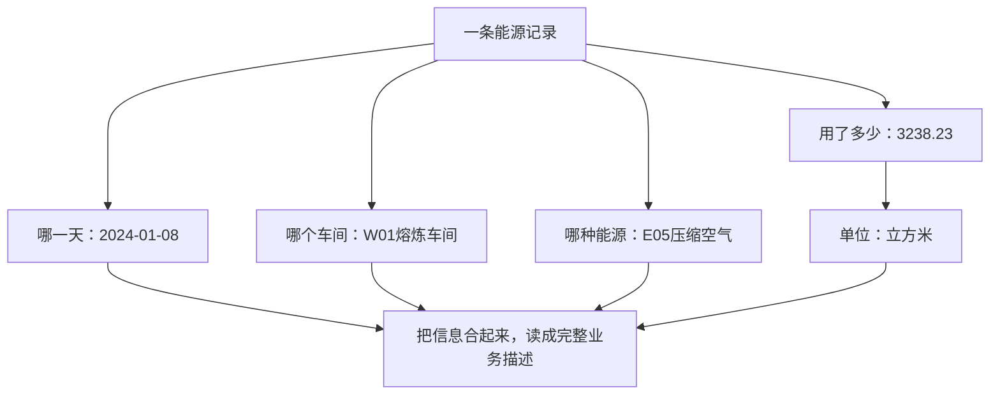

# 第二天：一条能源记录是什么意思？

两个月课程第2天，建议20～30分钟。今天不用运行代码，目标是把一行记录读成一句完整的话。

## 回顾
第一天：项目把能源和产量记录整理成指标、图表；总能耗增加不一定意味着单位产品更耗能。今天认识这些“记录”本身。

## 项目中的实际样本
来自data/raw_energy_data.csv当前第一条数据。它是项目模拟数据中的实际记录，不是真实工厂计量。

| 字段 | 样本 | 含义 |
|---|---|---|
| record_date | 2024-01-08 | 这笔记录对应的业务日期 |
| workshop_code | W01 | 车间编码 |
| workshop_name | 熔炼车间 | 车间名称 |
| energy_code | E05 | 能源编码 |
| energy_name | 压缩空气 | 能源品种 |
| consumption | 3238.23 | 消耗数量 |
| unit | m³ | 消耗单位：立方米 |

把这一行读成一句话：2024年1月8日，熔炼车间记录了3238.23立方米的压缩空气消耗。

## 一行、一个字段和一个值
表格的一行是记录；一列是字段，例如日期；交叉格中的2024-01-08是字段值。表头用于说明下面的数字分别是什么。

## 三张讲解卡片
| 卡片 | 今天记住什么 |
|---|---|
| 身份 | 日期、车间、能源共同标识记录所描述的业务对象 |
| 数量 | 数字必须带单位，3238.23本身不能说明用了什么 |
| 编码 | 编码帮助程序识别对象；名称帮助人阅读，需要对应一致 |

## 为什么不能只看数字？
同样是100，100度电和100立方米天然气不是同一种数量，不能直接相加成“200能源”。即便压缩空气和天然气都用立方米表示，它们仍是不同品种，不能仅因单位一样就混为一项。综合比较需要后续课程的统一换算口径。

## 能源数量与产量分开理解
这条原始记录还携带output_qty=260.729、output_unit=吨，表示该车间当天的产量。3238.23立方米是用了多少压缩空气；260.729吨是生产多少产品，两者意义不同。产量不是“压缩空气产量”。同一天多个能源行可能重复携带同一份产量，不能每行都再加一次，后面会详细讲。

今天不用记全部15个字段；单价、费用、状态、来源和更新时间留到第三天。字段data_source写MES只是模拟记录的来源标签，不能据此认为数据实际来自真实工厂系统。

## 小练习
教学假设：record_date=2025-02-03，workshop_code=W02，workshop_name=轧制车间，energy_code=E01，energy_name=电力，consumption=5000，unit=kWh。

1. 把它读成一句话。
2. 5000是什么数量？若没有unit，能否直接解释成5000度电？

参考答案：2025年2月3日，轧制车间记录了5000千瓦时（5000度）的电力消耗。5000是消耗数量；缺少单位时不能仅凭数字确认物理量和计量单位，应核查字段定义和能源配置。

## 两个理解检查
1. W01和熔炼车间是不是两条消耗？参考：不是，是同一车间的编码与名称。
2. 哪一天、哪个车间相同，能源不同，是否就代表重复？参考：不是，它们描述不同品种消耗。相同业务身份的多行还可能涉及重复或不同版本，后续学习去重与更新时间规则。

## 证据与进度
2026-10-04读取当前data/raw_energy_data.csv表头和第一行。本课没有运行清洗或数据库；样本属于模拟数据，练习属于教学假设。用户请求第二天，因此讲解进度推进到2；第一天与第二天掌握程度均未自动确认。
