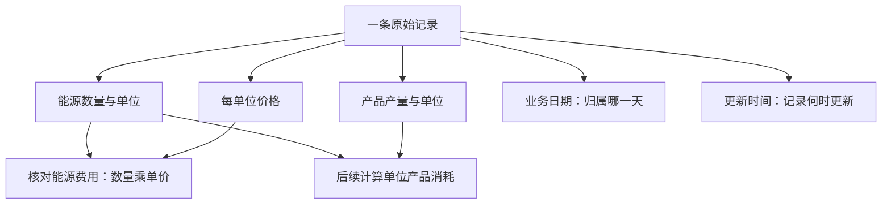

# 第三天：读懂单位、价格、费用、产量与更新时间

两个月课程第3天。建议20～30分钟，不需要运行代码。目标：把“用了多少、花了多少钱、生产了多少、何时更新”分清楚。

## 回顾
第二天一条记录的五个基本问题：哪一天、哪个车间、哪种能源、用了多少、什么单位。今天继续读同一条样本的其他字段。

## 项目实际样本
当前data/raw_energy_data.csv第一条记录：2024-01-08、W01熔炼车间、E05压缩空气。

| 字段 | 样本值 | 日常解释 |
|---|---|---|
| consumption | 3238.23 | 压缩空气消耗数量 |
| unit | m³ | 数量单位：立方米 |
| unit_price | 0.2841 | 项目口径下每立方米的价格，元/m³ |
| cost | 920.12 | 记录携带的这项能源费用，元 |
| output_qty | 260.729 | 该车间当日产量 |
| output_unit | 吨 | 产品产量单位 |
| record_date | 2024-01-08 | 业务发生日期 |
| updated_at | 2024-01-08 14:53:00 | 记录更新时间，不是设备开机时间 |

读成一句话：1月8日熔炼车间消耗3238.23立方米压缩空气，记录单价为每立方米0.2841元，记录费用为920.12元；车间当天产量260.729吨，记录带有14:53的更新时间。它是模拟数据，不是实际工厂计量。

## 三张讲解卡片
| 卡片 | 核心区别 |
|---|---|
| 能源账 | 消耗数量×对应单价，得到该项能源费用 |
| 生产账 | 产量是生产产品的数量，与能源消耗不同；产品单位也不同 |
| 时间账 | 业务日期说明事情属于哪一天；更新时间说明记录版本何时更新 |

## 费用怎么算：先看简单例子
教学假设：消耗1000度电，电价0.8元/度，费用=1000×0.8=800元。若当天生产100吨产品，每吨用电=1000÷100=10度/吨；这项电费摊到每吨是800÷100=8元/吨。三个量不同：0.8元/度是能源单价；10度/吨是单耗；8元/吨是单位产品电费。这里仅计电费，不代表产品全部成本。

单位也能检查公式：立方米×元/立方米=元。立方米×吨则不能解释成能源费用。

## 实际样本并不完全算得上，怎么办？
按原始CSV显示的数字：3238.23×0.2841=919.981143元，保留两位约919.98元，而cost字段为920.12元，相差约0.14元。不能把字段值照抄成“已经验证量价完全一致”。

生成器会把数量、单价分别舍入后写出，费用则使用舍入前的量价计算后保留两位；它也主动注入部分费用错误。因此原始样本可能存在小额精度差或其他质量问题。只凭这0.14元差额不足以确认样本的具体原因，需回查生成过程与清洗依据。本课只核对算式，尚未执行该记录的原因追溯。

这解释了为什么项目需要清洗与质量核对：原始数据是输入，不是天然正确的答案。

## 产量为什么不能直接相加？
同一车间同一天可能有电力、天然气、压缩空气等多条能源记录，每行重复携带同一份产量。它们描述不同能源，不代表生产了多次。同一天260.729吨出现四次，不能当成1042.916吨。今天记住这个风险，数据库课程再学如何正确组织与关联。

## 两种日期：事情发生与记录修改
教学假设：1月8日消耗记录到1月10日发现录错并修正。record_date仍为1月8日，updated_at变为1月10日的修改时刻。业务统计仍属于1月8日；判断是否收到新版本要关注更新时间。

不能把updated_at理解成采集精度或设备运行时段；本项目这个字段用于版本与装载进度，实际来源语义仍须根据系统定义确认。

## 剩余字段，今天认识即可
avg_temperature=-6.6为平均气温字段；record_status=正常为业务状态标签，不证明无数据错误或设备完好；data_source=MES为来源标签，MES通常指制造执行系统，模拟行写有该标签不表示来自真实MES。有关状态、来源和温度的生成规则后面再学习。

## 小练习（教学假设）
某车间record_date=2025-02-03，电力消耗5000 kWh，单价0.8元/kWh，产量200吨；2月5日修正记录。
1. 这项电费是多少？
2. 每吨产品用电是多少？
3. 修正后业务日期是否变成2月5日？
参考：4000元；25 kWh/吨；业务日期仍是2月3日，更新时间反映2月5日修正。该电费不是全部生产成本。

## 两个理解检查
1. 单价0.8元/度与单位产品电费20元/吨是一回事吗？参考：不是，前者每单位能源价格，后者每单位产品分摊的电费。
2. 状态写“正常”，能否跳过缺失、重复及费用核对？参考：不能，状态标签不等于全部质量检查通过。

## 证据与进度
读取当前data/raw_energy_data.csv表头与首行，并查看src/generate_data.py的量价舍入及费用错误注入代码。本课未启动服务或运行高级实验。项目样本是模拟数据，练习是教学假设。用户请求第三天，讲解进度到3；没有自动确认前两天或本课已掌握。
