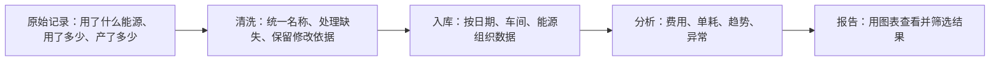

# 工业能耗项目：每日讲解与学习任务

每天约 15～20 分钟，从业务问题开始，再理解数据、代码和工程扩展。课程序号代表学习进度，不代表已经掌握。根据提问调整难度；遇到不理解的内容先复习。

## 每日格式

1. 一句话目标与上一课回顾。
2. 用项目实际文件讲解一个主题，术语第一次出现时解释。
3. 一张流程图或一组对比卡片。
4. 一个无需启动全部服务的小练习。
5. 两个理解检查问题，附参考答案。
6. 说明证据出处、模拟与真实数据的区别、尚未验证的边界。

## 21 天课程

| 课次 | 主题 | 当天小任务 | 主要依据 |
|---|---|---|---|
| 1 | 项目解决什么问题 | 说出三个能源管理问题 | README.md、docs/系统设计文档.md |
| 2 | 一行原始数据是什么意思 | 解释日期、车间、能源、消耗量、产量 | data/raw_energy_data.csv |
| 3 | 模拟数据与真实数据 | 区分主线模拟数据和独立真实案例 | src/generate_data.py、data/real/README.md |
| 4 | 数据为什么会脏 | 找出缺失、重复和异常的区别 | docs/数据清洗质量说明.md |
| 5 | 清洗与留痕 | 解释为什么异常单元格不能随意整行删除 | src/clean_data.py、docs/问题发现与工程复盘.md |
| 6 | 能耗、费用、单耗和碳排 | 算一个简单单耗例子 | docs/指标字典.md |
| 7 | 第一周复习 | 用自己的话讲清原始数据到干净数据 | 前六课 |
| 8 | 数据仓库与星型模型 | 区分事实表和维表 | sql/create_table.sql |
| 9 | 数据怎样入库 | 理解重复运行和历史修正 | src/import_mysql.py |
| 10 | SQL 怎样回答业务问题 | 读懂一个总览查询 | sql/analysis.sql |
| 11 | 同比、环比和待机损耗 | 区分用能增加与效率变差 | output/Q*.csv、docs/指标字典.md |
| 12 | 三种异常检测 | 解释异常为何需要核查 | docs/系统设计文档.md、sql/analysis.sql |
| 13 | 可视化报告 | 追踪一张图的数据来源 | src/make_report.py |
| 14 | 调度、测试和复习 | 画出完整主线并说明失败怎么办 | dags/energy_pipeline_dag.py、docs/测试文档.md |
| 15 | Hive、Spark 与分层数仓 | 理解 ODS/DWD/DWS/ADS 各自职责 | docs/阶段一_分层数仓与分布式计算.md |
| 16 | 预测模型 | 区分训练、测试和未来信息泄漏 | docs/阶段二_预测与智能归因.md |
| 17 | 归因助手与证据 | 区分预测、解释和已证实原因 | ml/attribution_assistant.py、阶段二文档 |
| 18 | 实时更新与 CDC | 理解新增、修改、删除怎样传递 | docs/阶段三_数据质量与实时管道.md |
| 19 | 服务化与数据治理 | 理解报告、接口和口径管理 | docs/阶段四_服务化与可视化交付.md、governance/ |
| 20 | 节能评估与真实案例 | 区分节能情景估计与实际改造效果 | docs/阶段五_能效基线与节能情景.md |
| 21 | 完整复述与答辩 | 用三分钟讲项目、证据和边界 | docs/面试问答.md、README.md |

## 第 1 课：这个项目到底在做什么？

把它想成一家工厂的“能源账本 + 体检报告”。电表和生产系统提供记录，项目把这些记录整理成能帮助管理者决策的结果。

它主要回答：哪个车间用能最多？同样生产一吨产品，哪个车间更耗能？停产时还有多少待机消耗？某天能耗突然增加，值得检查哪些记录？

对应主线文件依次为 src/generate_data.py、src/clean_data.py、src/import_mysql.py、sql/analysis.sql、src/make_report.py。Airflow 的作用是按顺序安排这些步骤，像生产线的调度员。

### 为什么只看总能耗不够？

假设昨天用电 1,000 度、生产 100 吨；今天用电 1,200 度、生产 150 吨。总用电增加了 20%，但每吨用电从 10 度降到 8 度，下降了 20%。因此“总能耗增加”与“每吨产品更耗能”是两个问题。

这个例子只用于解释计算，不是项目实测结果；产品、工况等条件不同时，单耗比较还需要进一步核查。

### 今天的小任务

打开 README.md 开头，找出项目的数据范围和交付结果，然后补全一句话：“这个项目把____加工成____，帮助工厂判断____。”

### 理解检查

1. 用电变多，是否一定说明效率变差？参考答案：不一定，还要看产量与工况。
2. 图表能否证明某次改造确实节能？参考答案：不能仅凭图表证明，还需要同厂实施日期、改造前后计量与可比较条件。

### 本课证据与边界

根据 README.md 与系统设计文档，主线覆盖 8 个车间、6 种能源、731 天，使用具有业务规律并主动注入质量问题的模拟数据。独立真实数据案例要单独讲解；不能把模拟数据结论称为真实工厂实测效果。上述文件内容已阅读，本次没有重新运行管道核验其全部历史结果。

## 可粘贴到每日自动任务的提示词

在 D:\industrial_energy_analysis 项目中，按 docs/每日项目讲解.md 从第一课开始，每次讲一课，每天约 15～20 分钟。先读取课程进度和本课实际源文件，以当前代码与证据为准。使用中文、日常语言、流程图或对比卡片，给出一个小练习和两个带参考答案的理解问题。区分模拟数据、真实案例、估算与已验证结论。生成课程到 D:\industrial_energy_analysis\docs\daily_lessons，记录已生成课次；没有用户反馈时不能标记已掌握。第一课已有正文可复用。用户提出疑问时先复习。第 21 课后转为复习与项目新增内容讲解。仅生成教学材料，不启动服务、不修改业务代码、不执行部署。每次完成后在聊天中展示本课要点和文件链接。所有新产物保存在 D 盘。

## 当前状态

- 第 1 课正文已准备；第 2～21 课为课程安排，尚未逐课生成。
- 学习掌握程度：等待用户反馈。
- 自动任务：后续已创建每日讲解任务；本处原“尚未启用”描述已过时。实时任务状态应以自动任务设置为准，本轮未读取或修改设置。
- 原建议时间为20:00；已保存任务快照为每日09:00。本轮不调整执行时间。

## 用户最新学习安排（优先，2026-10-03）
目标更新：完美掌握这个项目、可以完整复现，分两个月学习，不要求第一天全懂。以docs/两个月项目学习计划.md的60个学习日为课程顺序，原21课仅作为主题索引。每天只讲当前学习日，留复习与实操，遇到不理解先复习并允许顺延。不因为助手生成或验证了高级材料就推进用户课次；未收到反馈不得标记掌握。第一天只要求理解用途、总量/单耗的直观区别及模拟数据边界。既有高级材料留到对应课次使用，不要求第一天完成所有复现。保存材料仍在docs/daily_lessons，所有新产物优先D盘。

第一天当前教学入口：docs/daily_lessons/第01天_两个月课程版.md。旧第一课文件及高级练习保留作扩展参考，不作为当天要求。

后续每日讲解先读取docs/daily_lessons/learning_progress.json及两个月计划；用户反馈作为掌握依据，材料生成、助手实验及自动续行不能自动推进掌握状态。同日不因自动续行连续讲多个后续学习日。

